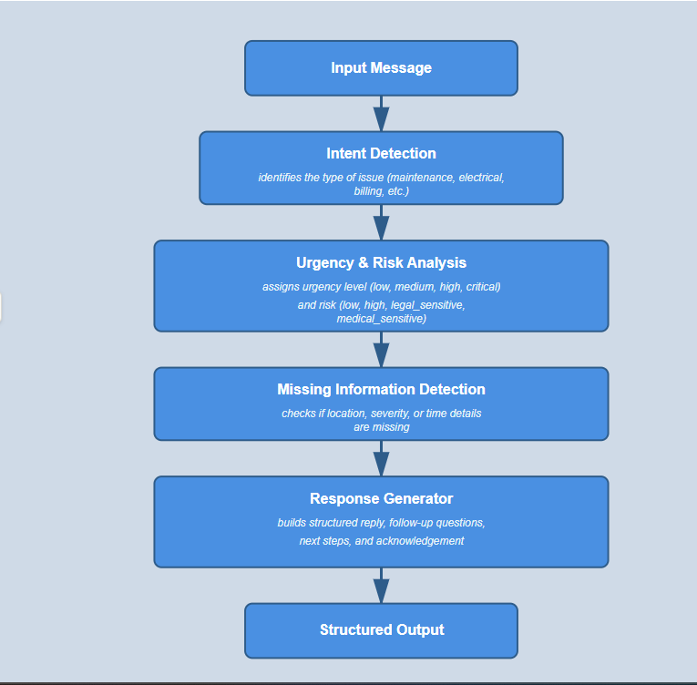

# Deterministic AI Workflow Engine for Customer Enquiries

## Project Overview
This project demonstrates a **rule-based AI workflow** that processes customer messages and generates structured, client-ready responses. It simulates a mock LLM (Large Language Model) behavior to:

- Detect **intent** of the message
- Classify **urgency** and **risk**
- Identify **missing information**
- Generate **structured replies** with follow-up questions and recommended next steps
- Provide **explainability** for decisions made

The workflow is deterministic, reliable, and designed to integrate a real LLM in the future without major changes.  

This project was developed as a practical assignment to showcase **applied AI engineering and workflow design**, without using external APIs.
## DEMO VEDIO 
[LINK](https://www.loom.com/share/bad52dbce4eb4857a9e6765573cbf10e)
## Folder Structure & Files

The project is organized as follows:

 - app.py # Main Python script implementing the deterministic workflow
 - test_suite.py # Test cases to verify workflow behavior for multiple scenarios
 - prompts_examples.txt # Sample prompts to simulate LLM responses
 - README.md # Project documentation
 - workflow_diagram.png # Workflow diagram illustrating the pipeline


### File Descriptions

- **app.py**: Contains the core rule-based logic for intent detection, urgency/risk classification, missing information detection, and structured response generation.
- **test_suite.py**: Runs multiple test inputs to demonstrate and validate the workflow's outputs.
- **prompts_examples.txt**: Stores sample prompts used to simulate LLM responses for demonstration purposes.
- **workflow_diagram.png**: Visual diagram of the workflow showing all stages from input to output.

## Workflow Description & Diagram

The system follows a deterministic AI workflow to process customer messages and generate structured responses. 

### Pipeline Steps

1. **Input Message**
   - Customer submits a message describing an issue or inquiry.

2. **Intent Detection**
   - Determines the type of issue: 
     - `maintenance_issue`, `electrical_issue`, `billing_issue`, `complaint_general`, `unclear_request`, `other`.
   - Uses keyword-based rules to classify intent.

3. **Urgency & Risk Detection**
   - Assigns urgency levels: `low`, `medium`, `high`, `critical`.
   - Assigns risk levels: `low`, `medium`, `high`, `legal_sensitive`, `medical_sensitive`.
   - Keywords trigger escalation for urgent or sensitive issues.

4. **Missing Information Detection**
   - Checks if essential details (location, severity, timing) are missing.
   - Adds follow-up questions to gather required information.

5. **Response Generation**
   - Generates acknowledgement, reply draft, next steps based on intent, urgency, and risk.
   - Ensures reliability by avoiding hallucinations or false promises.

6. **Structured Output**
   - Combines all detections and generated text into a JSON output with:
     ```
     intent, urgency_level, risk_level, acknowledgement, analysis_summary,
     reply_draft, follow_up_questions, missing_information, recommended_next_steps
     ```

### Workflow Diagram



- **Highlighted Stages**:
  - **Intent Detection** → Classifies the type of issue.
  - **Urgency & Risk Detection** → Determines criticality and potential risk.
  - **Missing Info Detection** → Identifies incomplete details for follow-up.

## Usage Instructions

1. Clone the repository:
   ```bash
   git clone <repo_url>
2. Create a virtual environment:
   ```bash 
   python -m venv venv
   source venv/bin/activate  # Linux/Mac
   venv\Scripts\activate     # Windows
3. Run the test suite:
    ```bash 
    python test_suite.py

## Test Cases / Sample Inputs & Outputs

Below are examples of different customer messages and the structured output generated by the system:

### Example 1
**Input:**
Small leak under the kitchen sink.

**Output:**
```json
{
    "intent": "maintenance_issue",
    "urgency_level": "low",
    "risk_level": "low",
    "acknowledgement": "Thank you for reaching out. We understand your concern.",
    "analysis_summary": "The issue appears related to maintenance_issue.",
    "reply_draft": "Our team will review this and guide you with next steps shortly.",
    "follow_up_questions": [
        "When did this issue first occur?",
        "Has this happened before?"
    ],
    "missing_information": [
        "When the issue started",
        "Severity level of the issue"
    ],
    "recommended_next_steps": [
        "Please share additional details.",
        "Avoid using the affected area until reviewed."
    ]
}
```
## Prompt Examples
This system can also be simulated with a prompt for a language model (LLM):
*Prompt template provided in prompt.txt*

**Input:**
Exposed electric wires sparking in the living room!

**Output:**
```json
{
  "intent": "electrical_issue",
  "urgency_level": "critical",
  "risk_level": "high",
  "acknowledgement": "Thank you for reporting this. Your safety is very important.",
  "analysis_summary": "The customer reports exposed electric wires sparking in the living room. This is an electrical issue involving active sparking, which presents an immediate fire and safety hazard.",
  "reply_draft": "Thank you for alerting us. Exposed wires that are sparking are a serious safety risk. \n\nPlease keep a safe distance from the area immediately. If it is safe to do so, turn off the power to that area from the breaker panel. Do not touch the wires. \n\nIf you see flames, smell burning, or feel unsafe at any point, please contact emergency services right away.\n\nWe are escalating this issue urgently and will arrange for an electrician to address it as soon as possible.",
  "follow_up_questions": [
  "Is anyone currently near the exposed wires?",
  "Do you see any flames or smell burning?",
  "Can you safely access the breaker panel to switch off power to that area?"
  ],
  "missing_information": [
  "When the issue started",
  "Severity details beyond sparking (e.g., flames, smoke)"
  ],
  "recommended_next_steps": [
  "Advise the resident to turn off power from the breaker if safe.",
  "Advise keeping distance from the affected area.",
  "Escalate immediately to emergency electrical maintenance.",
  "Recommend contacting emergency services if fire risk increases."
  ],
  "explainability": {
  "intent_detected": "The phrase 'electric wires sparking' clearly indicates an electrical issue.",
  "urgency_reasoning": "The word 'sparking' and exclamation mark suggest immediate danger and emergency conditions.",
  "risk_reasoning": "Exposed electrical wires with active sparking present a high fire and electrocution risk."
  }
}

```

## Prompt Design (LLM Integration Prototype)
```
You are an AI assistant that reads a customer message and generates a structured response in JSON format.

Your task:

1. Detect the intent of the message from these allowed categories:
   - maintenance_issue
   - billing_issue
   - electrical_issue
   - complaint_general
   - unclear_request
   - other

2. Detect urgency level:
   - low, medium, high, critical
   - Consider keywords like "urgent", "emergency", "severe", "fire", "flooding" for high
   - "soon", "quick", "immediate" for medium
   - Default is low

3. Detect risk level:
   - low, medium, high, legal_sensitive, medical_sensitive
   - High-risk keywords: fire, gas, electric, flooding
   - Legal/medical terms → legal_sensitive / medical_sensitive

4. Detect missing information:
   - If location (kitchen, bathroom, room, wall, ceiling) not mentioned → ask
   - If start time (today, yesterday, hours, days) missing → ask
   - If severity (minor, small, large, serious, severe) missing → ask

5. Generate a structured response including:
   - acknowledgement
   - analysis_summary
   - reply_draft
   - follow_up_questions
   - missing_information
   - recommended_next_steps
   - explainability (how intent, urgency, risk were detected)

6. Apply these constraints:
   - Do NOT hallucinate facts
   - If input is empty → return error response
   - If message <5 words → mark as unclear_request
   - If unsure → say "Information insufficient"
   - Never promise specific repair times
   - Include clarifying follow-up questions if info is missing

7. Use simple, client-friendly language.

8. Output format (JSON):

{
  "intent": "",
  "urgency_level": "",
  "risk_level": "",
  "acknowledgement": "",
  "analysis_summary": "",
  "reply_draft": "",
  "follow_up_questions": [],
  "missing_information": [],
  "recommended_next_steps": [],
  "explainability": {
      "intent_detected": "",
      "urgency_reasoning": "",
      "risk_reasoning": ""
  }
}

```

### Reliability & Limitations

- Deterministic Outputs: Rule-based workflow ensures consistent results.
- No Hallucinations: Does not invent information not present in the input.
- Missing Info Handling: Clearly identifies missing or unclear details.

**Limitations**:
- Cannot handle highly nuanced language or sarcasm.
- Cannot learn from new examples automatically.
- Requires predefined keywords for detection.

### Future Improvements
- Integrate a real LLM to handle nuanced or complex language inputs.
- Expand intent categories and risk/urgency levels.
- Add sentiment and tone detection for more human-like responses.
- Include automatic escalation for sensitive cases.
  
